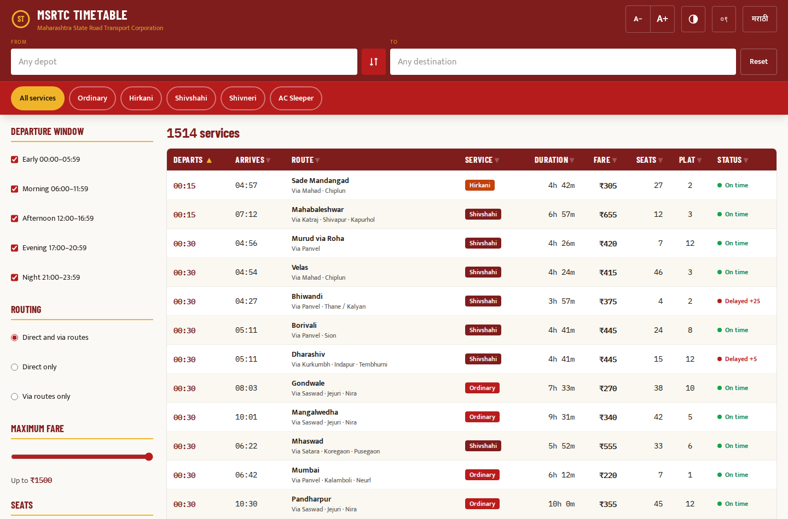
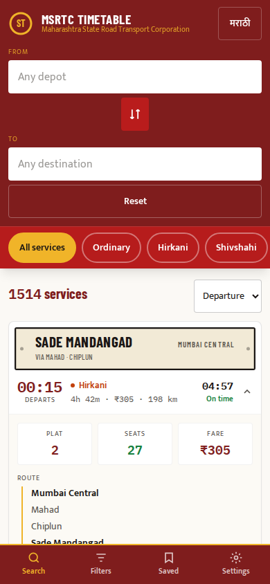
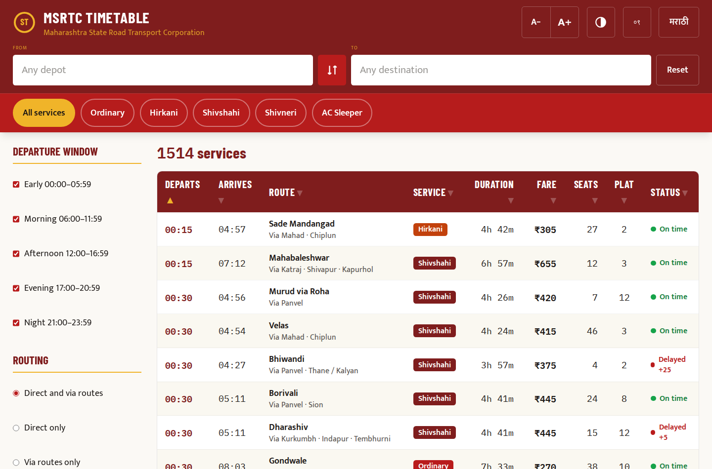

# Maharashtra ST Bus Timetable · एसटी वेळापत्रक

**An offline-first, bilingual (English / मराठी), accessibility-first timetable web app for Maharashtra State Road Transport Corporation (MSRTC) bus services — deployable as a single HTML file on any web server.**

> ⚠️ **Unofficial project.** This is an independent, community-built reference tool. It is **not** developed, endorsed, or operated by MSRTC or the Government of Maharashtra. Always confirm departures at the depot enquiry counter. Officials interested in adopting or adapting it: see [For Government Adopters](#for-government-adopters).


| Desktop table view | Mobile card view | Large-text mode |
|---|---|---|
|  |  |  |

---

## Why this exists

MSRTC publishes divisional timetables as scanned PDF images in Marathi — unsearchable, unreadable on a phone, and invisible to screen readers. This project turns published depot timetable data into a fast, searchable interface that:

- loads once and then **works with no network at all** (rural 2G/3G is the target environment),
- reads correctly to **screen readers**, scales to **145% text size** without breaking, and offers a **high-contrast mode**,
- speaks **both Marathi and English**, including **Devanagari numerals** (०९.३०) exactly as printed on depot वेळापत्रक sheets,
- ships as **one HTML file** — no framework, no build pipeline, no database, no server-side code. Any static host, government NIC server, or ₹100/month shared host can serve it.

## Features

- **1,514 services · 278 stations** from Ratnagiri, Mumbai Central, Pune Swargate and Kurundwad depot sheets
- Source/destination search with bilingual autocomplete — type `rat` or `रत्ना`, both find Ratnagiri
- Filters: service class (Ordinary/Lal Dabba, Hirkani, Shivshahi, Shivneri, AC Sleeper), departure window, direct vs via, max fare, seat availability
- **Destination-board cards** on mobile — each route rendered as the enamel plate on the front of an ST bus
- Sortable desktop table with **multi-column sort** (Shift-click adds a secondary key)
- Live analytics panel: earliest/latest departure, fare average, departures-by-hour histogram
- Saved services for offline reference
- Installable PWA with a versioned service worker
- Full keyboard operation, focus-trapped dialogs, `aria-live` result announcements, skip link, 48 px touch targets

## Quick start

There is nothing to build.

```bash
git clone https://github.com/<your-user>/maharashtra-st-timetable.git
cd maharashtra-st-timetable
python3 -m http.server 8080        # any static server works
# open http://localhost:8080
```

> Opening `index.html` via `file://` works for browsing, but the service worker (offline mode) requires `http://localhost` or HTTPS.

### Deploy

| Target | How |
|---|---|
| **GitHub Pages** | Enable Pages on this repo — the included workflow (`.github/workflows/deploy-pages.yml`) publishes automatically on push to `main`. |
| **nginx (Linux)** | `deploy/nginx.conf` — TLS, compression, correct service-worker cache headers. |
| **IIS (Windows Server)** | `deploy/web.config` — drop in the site root beside `index.html`. |
| **Apache** | `deploy/htaccess.txt` — rename to `.htaccess` in the web root. |

**The one rule that must not be broken:** `sw.js` must be served with `Cache-Control: no-cache`. A cached service worker can never be replaced; get this wrong and returning users are pinned to an old timetable with no recovery short of manually clearing their browser. All three provided configs enforce this. Bump `CACHE_VERSION` in `sw.js` on every deploy.

## Data: what is real and what is modelled

Honesty about data is a feature of this project, not a footnote.

| Field | Status |
|---|---|
| Origin depot, destination, **departure time**, via-stops | **Real** — extracted from published depot timetable sheets |
| Arrival time, duration, distance, fare, service class, platform, seats, live status | **Modelled/synthetic** — the sources do not publish them |

The app states this in-product (Settings → Data sources, in both languages). The extracted source rows are in [`data/timetables_web_extracted.csv`](data/timetables_web_extracted.csv); see [`data/README.md`](data/README.md) for provenance and the extraction method.

**Before any public/official launch:** replace the modelled fields with real feeds or remove those columns. Publishing synthetic "live status" to real passengers is misinformation.

## For government adopters

This codebase is MIT-licensed: MSRTC, NIC, or any state transport undertaking may use, modify, rebrand, and deploy it **without permission and without payment**, including in closed-source derivatives. Practical notes:

1. **Data ingestion is the real work.** The UI accepts any dataset matching the packed JSON schema documented in `index.html` (§1 of the script). Wire it to your scheduling database and the interface is done.
2. **Compliance posture:** WCAG 2.2 AA patterns throughout (GIGW-aligned); bilingual per the Official Languages Act expectations; zero third-party analytics, zero trackers, zero cookies — the only persistence is the user's own device `localStorage`.
3. **Hardening for scale:** self-host the Tailwind build and fonts (removes the CDN dependency and the `unsafe-eval` CSP concession — see comments in `deploy/nginx.conf`), and put the file behind any CDN. It is a static asset; it scales like one.
4. The MSRTC name and "ST" mark belong to MSRTC. This repo uses them descriptively; an official deployment obviously may use them officially, and unofficial forks should keep the disclaimer.

## Architecture

```
index.html      ← everything: markup, styles, script, and the packed dataset (~140 KB, ~35 KB gzipped)
sw.js           ← service worker (separate by necessity — blob workers cannot control scope)
manifest.json   ← PWA manifest
icon-*.png      ← app icons
```

Inside `index.html`: Tailwind (CDN) for utilities, vanilla ES6 in one strict-mode IIFE, dataset packed as positional arrays (≈70 KB for 1,514 services), single-pass filter pipeline that re-renders in well under a frame — filtering is instant with no debounce because there is nothing to hide.

## Contributing

Timetable corrections, new depot data, and Marathi translation fixes are the most valuable contributions. See [CONTRIBUTING.md](CONTRIBUTING.md). Security reports: [SECURITY.md](SECURITY.md).

## License

[MIT](LICENSE) — use it, fork it, ship it. Attribution appreciated, never required.
